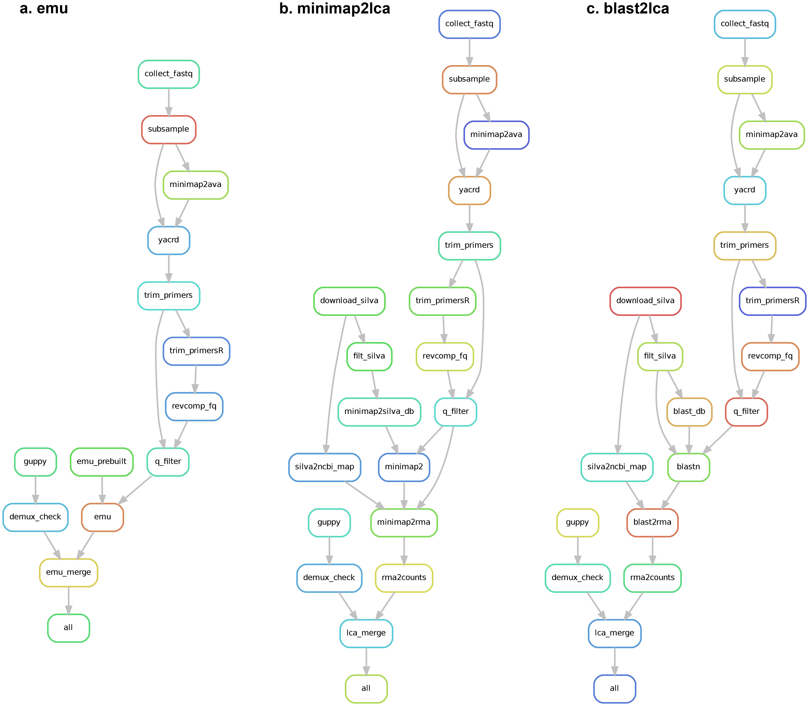

1. TOC
{:toc}

---

## Use **NART** for long amplicon profiling by read classification

[`NART`](https://github.com/yanhui09/nart) is desgined for mapping-based Nanopore Amplicon (**Real-Time**) analysis, e.g., 16S rRNA gene.
`NART` utils are composed of `nart` (Nanopore Amplicon Real-Time entry) and `nawf` (Nanopore Amplicon `snakemake` WorkFlow entry) in one python package.
`NART` provides an (real-time) end-to-end solution from bascecalled reads to the final count matrix through mapping-based strategy. You can 

`nawf` provide three options (i.e., `emu`, `minimap2lca` and `blast2lca`) to determine microbial composition.


## **NART** installation

The full installation guide of `NART` is available [here](https://github.com/yanhui09/nart).

You can choose to install `NART` with `docker` image (which is only solution for `MacOS` users) or from the `GitHub` repository according to your `OS` and preference.

### Docker image

The easiest way to use `NART` is to pull the `docker` image from [Docker Hub](https://hub.docker.com/r/yanhui09/nart) for cross-platform support.
```
docker pull yanhui09/nart
```

{: .important }
> `NART` is built for `linux/amd64` platform, with cross-platform support through `docker`. 
>
> `MacOS` users needs to use docker container to run `NART`.

### Installation from GitHub repository

**1.** Clone the Github repository and create an isolated `conda` environment
```
git clone https://github.com/yanhui09/nart.git
cd nart
mamba env create -n nart -f env.yaml 
```

**2.** Install `NART` with `pip`
      
To avoid inconsistency, we suggest installing `NART` in the above `conda` environment
```
conda activate nart
pip install --editable .
```

## A demo run with **NART**

Find a full usage guide [here](https://github.com/yanhui09/nart#usage).

A video tutorial can be found [here](https://www.youtube.com/watch?v=TkdJGLOscPg).

### Example with a quick start
#### **Amplicon analysis in single batch**
`nawf` can be used to profile any single basecalled `fastq` file from a Nanopore run or batch.
```
nawf config -b /path/to/basecall_fastq -d /path/to/database    # init config file and check
nawf run all                                                   # start analysis
```

#### **Real-time analysis**
`nart` provide utils to record, process and profile the continuously generated `fastq` batch.

Before starting real-time analysis, you need `nawf` to configure the workflow according to your needs. 
```
nawf config -d /path/to/database                               # init config file and check
```

In common cases, you need three independent sessions to handle monitor, process and visulization, repectively.

**1.** Minitor the bascall output and record
```
nart monitor -q /path/to/basecall_fastq_dir                    # monitor basecall output
```
**2.** Start amplicon analysis for new fastq
```
nart run -t 10                                                 # real-time process in batches
```
**3.** Update the feature table for interactively visualize in the browser
```
nart visual                                                    # interactive visualization
```

### Get familiar with `NART` usage

`NART` is composed of two sets of scripts: `nart` and `nawf`, which controls real-time analysis and workflow performance, respectively.

Remember to activate the `conda` environment if `NART` is installed in a `conda` environment.
```
conda activate nart
nawf -h
nart -h
```

**To use the docker image**, you need to mount your data directory, e.g., `pwd`, to the  `/home` in the container.
```
docker run -it -v `pwd`:/home --network host --privileged yanhui09/nart
nawf -h
nart -h
```

{: .important }
> **Note: `--network host` is required for `nart monitor` to work.**

### Run `NART` with a demo datset

**0.** Make sure you have downlowded the required demo dataset from [here](https://github.com/yanhui09/MAC2023-extra). And the enter the directory with `cd`. 

E.g., Enter a directory with an absolute path ("long path") is `/home/me/MAC2023-extra`.
```
cd /home/me/MAC2023-extra
```

If you haven't downloaded the data yet and with `Git` installed,

```
git clone https://github.com/yanhui09/MAC2023-extra.git
cd ./MAC2023-extra 
```

#### **1. Analyze an accomplished ONT run with `nawf`**

**1.1.** Check where you are and try `laca init`, check the genereated `config.yaml` file.
```
pwd
nawf config -b ./data/ont16s/*.fastq.gz -d ./database -w ./nart_output
cat ./nart_output/config.yaml
```

**1.2.** Start `nawf` in a dry run 
```
nawf run all -w ./nart_output -n
```

#### **2. Real-time analysis with `nart`**

**2.1.** Re-generate the `config.yaml` file without `-b` flag
```
rm -rf ./nart_output
nawf config -d ./database -w ./nart_output
head ./nart_output/config.yaml
```

{: .important }
> Check the changes of `basecall_fq` in the `config.yaml` file. 

**2.2.** Monitor the bascalling output and record
``` 
nart monitor -q ./data/ont16s -w ./nart_output
```

`nart monitor` creates a `fqs.txt` in the working directory to record the coming `fastq` files.

**2.3.** Start amplicon analysis (requiring a new terminal)
```
nart run -t 4 -w ./nart_output
```

{: .important }
> In a new terminal, check the actions of `nart monitor`
> ```
> ls ./nart_output
> cat ./nart_output/fqs.txt
> cp ./data/ont16s/*.fastq.gz ./data/ont16s/new.fastq.gz
> cat ./nart_output/fqs.txt
> ```
> 
> Check the changes of content in the `fqs.txt` file. 
 
`nart run` stores the batch-specific count matrix under the folder `batches`. 
And the merged table (`otu_table.tsv`) is updated iteratively when a new matrix is created.

While you see one `otu_table.tsv` in the output folder, i.e., `nart_output/`,
you can try the interactive visualization below.

**2.4.** Interactive visualization in a browser (requiring a new terminal)
```
nart visual -i ./nart_output
```

Open the generated link in your browser. And you are expected to see an interactive barplot as below.


{: .important }
> **`MacOS` user couldn't experience `nart visual` through `docker`. :(**
>
> The host networking driver only works on Linux hosts, and is not supported on Docker Desktop for Mac, Docker Desktop for Windows, or Docker EE for Windows Server. [[Read more]](https://docs.docker.com/network/drivers/host/)