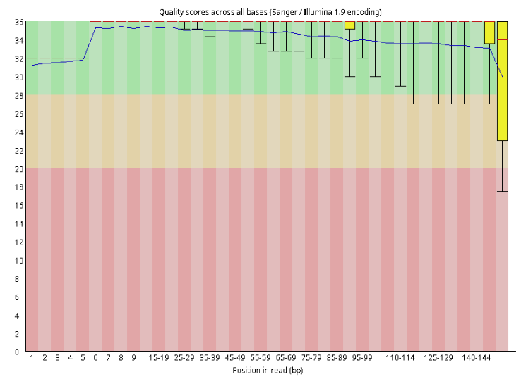
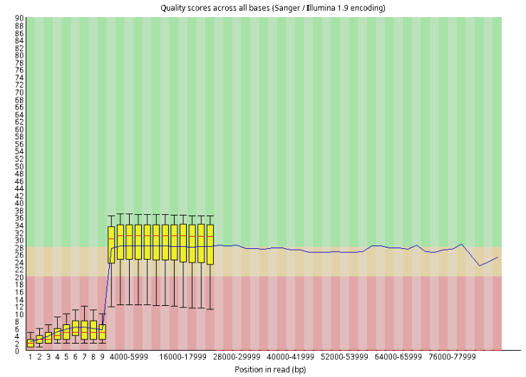

1. TOC
{:toc}

---
## Genome assembly with 2nd and 3rd WGS data

In this session, we aim to assemble a bacterial genome using 2nd and 3rd whole genome sequencing (WGS) data. 
We will use it this as example to explore the WGS data analysis, and look into the difference between sequencing technologies.

## Software installation with `mamba`

It's recommended to install the software with `mamba` in a **independent** conda environment.

Assuming you have installed `mamba` in your system, you can create a new conda environment with `mamba` and install the software with the following commands:

Go to the downloaded data directory. *Make sure you know where you are in the terminal.*

E.g., The downloaded data directory is placed at /home/username/MAC2023-extera.

```
cd /home/username/MAC2023-extera
pwd
```

You shall see the path of the downloaded data directory as below.
```
/home/username/MAC2023-extera
```

Now you can create a new conda environment with `mamba` and install the software with the following commands:

```
mamba env create -n wgs1 -f envs/env1.yaml
```

Activate the environment for the following analysis.

```
conda activate wgs1
```

## Exporation with a demo data

The WGS data can be fetched from [MAC2023-extra](https://github.com/yanhui09/MAC2023-extra) as before.
You shall download the data already if you have completed the previous exercises. In case you haven't, you can refer to the [requisites](https://yanhui09.github.io/MAC2023/exercieses/requisites) section.   

### First look at the data with `seqkit` and `fastqc`

```
seqkit stat data/wgs/*.fastq.gz data/wgs/ncbi_pacbio_TL110.fasta
```

Expected output:
```
file                              format  type  num_seqs     sum_len    min_len    avg_len    max_len
data/wgs/NXT20x_R1.fastq.gz       FASTQ   DNA    200,000  30,200,000        151        151        151
data/wgs/NXT20x_R2.fastq.gz       FASTQ   DNA    200,000  30,200,000        151        151        151
data/wgs/ont_r10_20x.fastq.gz     FASTQ   DNA      7,862  51,201,670        129    6,512.6     87,688
data/wgs/ncbi_pacbio_TL110.fasta  FASTA   DNA          1   2,566,312  2,566,312  2,566,312  2,566,312
```

Here is a set of sequencing data from a *Propionibacterium freudenreichii* strain. 
We subsampled the sequencing data to 20x coverage for the Illumina and Nanopore reads. 
The PacBio reference genome is from the [NCBI RefSeq database](https://www.ncbi.nlm.nih.gov/nuccore/NZ_CP085641.1). 

*Q1: What is the genome size of this strain? How is the sequencing coverage calculated?*

illumina: 30,200,000*2/2,566,312≈20  
ONT: 51,201,670/2,566,312≈20

Let's have a look at the quality of the sequencing data with `fastqc`.

```
mkdir -p fastqc/illumina fastqc/ont_r10
fastqc data/wgs/NXT20x_R*.fastq.gz -o ./fastqc/illumina
fastqc data/wgs/ont_r10_20x.fastq.gz -o ./fastqc/ont_r10
```

You can open the html files in the `fastqc` directory to have a look at the quality of the sequencing data.

**Illumina**


**Nanopore**


We could see the ONT reads is way longer but contains more errors than the Illumina reads. 

### Genome assembly with Illumina reads

#### Adapter removal with `trimmomatic`

`trimmomatic` is a tool for trimming adapters and low quality reads. The illumina reads ere collected from the NextSeq platform, using the Nextera library preparation kit.

```
mkdir illumina
trimmomatic PE -threads 4 -phred33 data/wgs/NXT20x_R1.fastq.gz data/wgs/NXT20x_R2.fastq.gz illumina/NXT20x_R1_paired.fastq.gz illumina/NXT20x_R1_unpaired.fastq.gz illumina/NXT20x_R2_paired.fastq.gz illumina/NXT20x_R2_unpaired.fastq.gz ILLUMINACLIP:data/wgs/NexteraPE-PE.fa:2:30:10 LEADING:3 TRAILING:3 MINLEN:50
```

#### Reads quality control with `bbmap`

```
#clumpify
clumpify.sh in=illumina/NXT20x_R1_paired.fastq.gz in2=illumina/NXT20x_R2_paired.fastq.gz out=illumina/NXT20x_R1_paired_dedup.fastq.gz out2=illumina/NXT20x_R2_paired_dedup.fastq.gz dedupe optical spany adjacent
# bbduk
bbduk.sh in=illumina/NXT20x_R1_paired_dedup.fastq.gz in2=illumina/NXT20x_R2_paired_dedup.fastq.gz out=illumina/NXT20x_R1_paired_dedup_deduk.fastq.gz out2=illumina/NXT20x_R2_paired_dedup_deduk.fastq.gz ref=data/wgs/phiX174.fasta k=31 hdist=1
```

#### Genome assembly with `spades`  

```
spades.py --isolate -t 4 -1 illumina/NXT20x_R1_paired_dedup_deduk.fastq.gz -2 illumina/NXT20x_R2_paired_dedup_deduk.fastq.gz -o illumina/spades
```

### Genome assembly with Nanopore reads

#### Optional: Adapter removal with `guppy` or `porechop`

```
guppy_barcoder -i data/wgs/ont_r10_20x.fastq.gz -s ont_r10/ont_r10_20x_barcoded.fastq.gz --barcode_kits EXP-NBD104 --trim_barcodes
```

```
porechop -i data/wgs/ont_r10_20x.fastq.gz -o ont_r10/ont_r10_20x_porechop.fastq.gz --threads 4
```

#### Reads quality control with `seqkit`

```
mkdir ont_r10
seqkit seq -j 4 -Q 10 -m 2000 -i data/wgs/ont_r10_20x.fastq.gz -o ont_r10/ont_r10_20x_f.fastq.gz
```

#### Genome assembly with `flye`

```
flye --nano-raw ont_r10/ont_r10_20x_f.fastq.gz --out-dir ont_r10/flye --threads 4
```

#### Genome polishing with `racon` and `medaka`

```
medaka tools list_models
medaka_consensus -i ont_r10/ont_r10_20x_f.fastq.gz -d ont_r10/flye/assembly.fasta -o ont_r10/medaka -t 4 -m r1041_e82_260bps_hac_v4.1.0
```

```
mkdir ont_r10/racon
minimap2 -t 4 -x map-ont ont_r10/flye/assembly.fasta ont_r10/ont_r10_20x_f.fastq.gz > ont_r10/racon/flye_assembly.paf
racon -t 4 ont_r10/ont_r10_20x_f.fastq.gz ont_r10/racon/flye_assembly.paf ont_r10/flye/assembly.fasta > ont_r10/racon/racon.fasta
medaka_consensus -i ont_r10/ont_r10_20x_f.fastq.gz -d ont_r10/racon/racon.fasta -o ont_r10/racon/medaka -t 4 -m r1041_e82_260bps_hac_v4.1.0
```

### Hybrid assembly with Nanopore and Illumina reads

#### Illumina reads polishing with `pilon`

```
mkdir -p hybrid/pilon
bwa index ont_r10/medaka/consensus.fasta
bwa mem -t 4 ont_r10/medaka/consensus.fasta illumina/NXT20x_R1_paired_dedup_deduk.fastq.gz illumina/NXT20x_R2_paired_dedup_deduk.fastq.gz | samtools sort -@ 4 -o hybrid/pilon/aligned.bam
samtools index hybrid/pilon/aligned.bam
pilon --genome ont_r10/medaka/consensus.fasta --frags hybrid/pilon/aligned.bam --output hybrid/pilon/pilon --threads 4
```

#### Optional: hybrid assembly with `unicycler`

```
unicycler -l ont_r10/ont_r10_20x_f.fastq.gz -1 illumina/NXT20x_R1_paired_dedup_deduk.fastq.gz -2 illumina/NXT20x_R2_paired_dedup_deduk.fastq.gz -o hybrid/unicycler --threads 4
```

### Quality assessment of assembled genomes with `quast`

```
seqkit stat data/wgs/assemblies/*.fasta
quast data/wgs/assemblies/*.fasta -r data/wgs/ncbi_pacbio_TL110.fasta -o quast
```

### Optional: Reference-guided correction with `proovframe`

#### Genome annotation with `prokka`

```
mkdir proovframe
source activate wgs2
prokka --outdir proovframe/prokka --prefix pacbio --cpus 4 data/wgs/ncbi_pacbio_TL110.fasta
```

#### Frameshift correction with `proovframe`

```
proovframe map -a proovframe/prokka/pacbio.faa -o proovframe/pilon.tsv hybrid/pilon/pilon.fasta
proovframe fix -o proovframe/pilon_corrected.fasta hybrid/pilon/pilon.fasta proovframe/pilon.tsv
```

